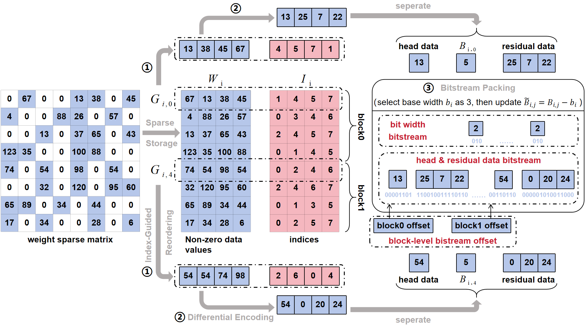
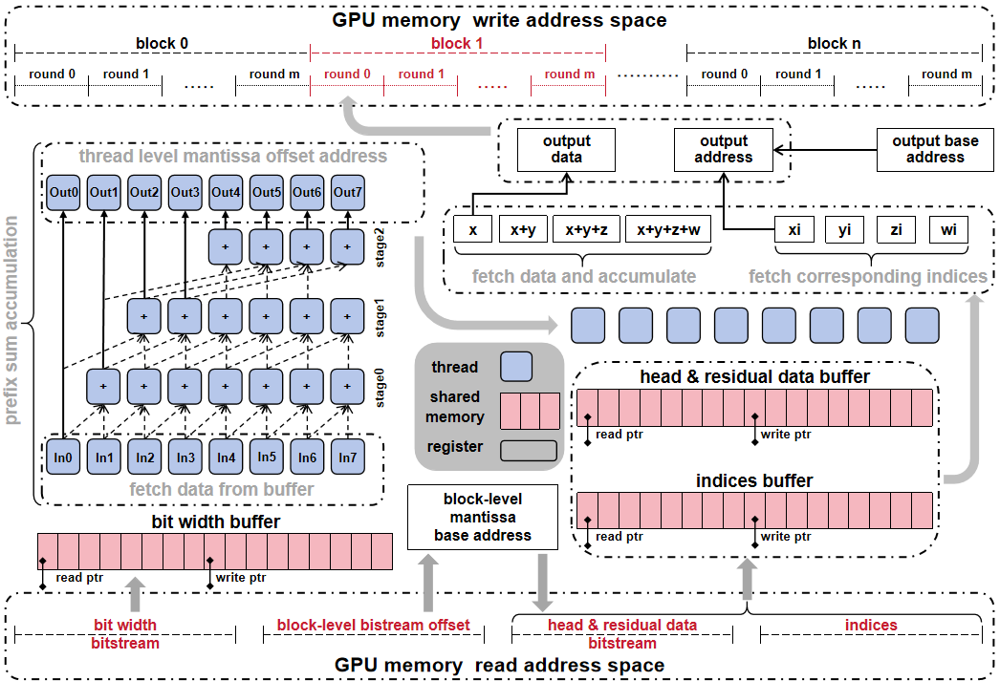

# ISDC_sourceCode
# ISDC: Index-Sorted Differential Compression for N:M Sparse Large Language Models

[](LICENSE)

Official implementation of **ISDC (Index-Sorted Differential Compression)**, a lossless compression framework for efficient storage and deployment of N:M sparse large language models.

---

## Overview

Large language models (LLMs) contain billions of floating-point parameters, resulting in substantial storage and memory overhead. Existing lossless compression methods often struggle to effectively compress floating-point mantissa streams due to their inherently high entropy.

ISDC addresses this challenge by leveraging the structural characteristics of N:M sparsity. Specifically, ISDC utilizes sparse index information to reorder non-zero weights, transforming high-entropy mantissa values into low-entropy differential representations that are more amenable to compression.

The framework further introduces a GPU-oriented decompression pipeline that enables efficient parallel reconstruction of compressed sparse weights.

### Key Features

- Lossless compression for N:M sparse neural network weights
- Index-guided sorting strategy
- Differential mantissa encoding
- Shared bit-width representation
- GPU-parallel decompression kernels
- Exact reconstruction with zero accuracy degradation

---

## Framework
## Framework

ISDC consists of a compression stage and a GPU-oriented decompression stage.

### Compression

<p align="center">

</p>

The compression stage exploits sparsity-induced index information to transform high-entropy mantissa streams into compact differential representations. Specifically, ISDC:

1. Extracts non-zero values from N:M sparse matrices.
2. Reorders values according to sparse index information.
3. Applies differential encoding within each sparse group.
4. Compresses residuals using a shared bit-width representation.

### Decompression

<p align="center">

</p>

The decompression stage leverages massively parallel GPU kernels to reconstruct sparse weights directly from compressed bitstreams, enabling efficient sparse model deployment while preserving exact numerical accuracy.


---

## Repository Structure

```text
ISDC/
│
├── compressor/
│   ├── compress.py
│   ├── decompress.py
│   ├── differential_encode.py
│   ├── differential_decode.py
│   └── bitpack.py
│
├── cuda/
│   ├── isdc_kernel.cu
│   ├── ring_buffer.cu
│   ├── prefix_sum.cu
│   └── CMakeLists.txt
│
├── benchmark/
│   ├── compression_ratio.py
│   ├── decompression_speed.py
│   ├── entropy_analysis.py
│   └── ablation_sorted_vs_unsorted.py
│
├── examples/
│   ├── opt125m.py
│   ├── opt350m.py
│   └── opt1.3b.py

├── figures/
│
├── data/
│
├── requirements.txt
├── LICENSE
└── README.md
```


## Installation

### 1. Create a Conda Environment

```bash
conda create -n ISDC python=3.11
conda activate ISDC


### 2. Install PyTorch

For CUDA 11.8:

```bash
pip install torch==2.7.1 torchvision==0.22.1 torchaudio==2.7.1 \
    --index-url https://download.pytorch.org/whl/cu118
```

### 3. Install Dependencies

```bash
pip install -r requirements.txt
```

### 4. Verify Installation

```bash
python -c "import torch; print(torch.__version__)"
```

Expected output:

```text
2.7.1
```

---

## System Requirements

* Ubuntu 22.04 / 24.04
* Python >= 3.10
* CUDA >= 11.8

The experiments in the paper were conducted on:

* CPU: Intel Xeon Platinum 8380
* GPU: NVIDIA RTX A6000
* CUDA: 12.0
* PyTorch: 2.7.1

```
```


## Usage

This section describes how to run ISDC compression and decompression.

---

## 1. Prepare Sparse Weight Files

Before compression, prepare N:M sparse weight matrices in the expected format.

Example directory:

```text
data/
├── opt125m_4_8/
│   ├── model_decoder_layers_0_fc1.json
│   ├── model_decoder_layers_0_fc2.json
│   └── ...
```

Each file should contain the sparse weight values and corresponding sparse index information.

---

## 2. Run ISDC Compression

To compress N:M sparse weights, run:

```bash
python compressor/compress.py \
    --input_path data/opt125m_4_8 \
    --output_path compressed/opt125m_4_8 \
    --pattern 4:8 \
    --dtype float16
```

Arguments:

```text
--input_path    Path to the input sparse weight files.
--output_path   Path to save compressed ISDC bitstreams.
--pattern       N:M sparsity pattern, e.g., 2:4, 4:8, 8:16.
--dtype         Data type of weights, e.g., float16, bfloat16, float32.
```

After compression, the output directory will contain:

```text
compressed/opt125m_4_8/
├── head_stream/
├── bitwidth_stream/
├── residual_stream/
└── metadata.json
```

---

## 3. Run ISDC Decompression

To reconstruct weights from compressed ISDC streams, run:

```bash
python compressor/decompress.py \
    --input_path compressed/opt125m_4_8 \
    --output_path recovered/opt125m_4_8 \
    --pattern 4:8 \
    --dtype float16
```

Arguments:

```text
--input_path    Path to compressed ISDC bitstreams.
--output_path   Path to save reconstructed sparse weights.
--pattern       N:M sparsity pattern used during compression.
--dtype         Data type of reconstructed weights.
```

---

## 4. Verify Exact Reconstruction

To verify that decompression is lossless, run:

```bash
python benchmark/verify_reconstruction.py \
    --original_path data/opt125m_4_8 \
    --recovered_path recovered/opt125m_4_8
```

Expected output:

```text
All weights are exactly reconstructed.
Maximum absolute error: 0.0
```

---

## 5. Run Compression Ratio Evaluation

To evaluate compression ratio, run:

```bash
python benchmark/compression_ratio.py \
    --input_path data/opt125m_4_8 \
    --compressed_path compressed/opt125m_4_8 \
    --pattern 4:8 \
    --dtype float16
```

The script reports:

```text
Original size
Compressed size
Compression ratio
Metadata overhead
```

---

## 6. Run GPU Decompression Benchmark

To benchmark GPU-side decompression latency, first compile the CUDA kernels:

```bash
cd cuda
mkdir -p build
cd build
cmake ..
make -j
```

Then run:

```bash
python benchmark/decompression_speed.py \
    --compressed_path compressed/opt125m_4_8 \
    --pattern 4:8 \
    --dtype float16
```

The script reports:

```text
Average decompression latency
Throughput
GPU memory usage
```

---

## 7. Reproduce Main Experiments

Example scripts are provided in the `examples/` directory.

For OPT-125M:

```bash
python examples/opt125m.py \
    --pattern 4:8 \
    --dtype float16
```

For OPT-350M:

```bash
python examples/opt350m.py \
    --pattern 4:8 \
    --dtype float16
```

For OPT-1.3B:

```bash
python examples/opt1.3b.py \
    --pattern 4:8 \
    --dtype float16
```

---

## Notes

* ISDC is a lossless compression method. The decompressed weights should be exactly identical to the original sparse weights.
* Larger N:M group sizes usually provide better compression ratios but may introduce higher decompression overhead.
* The current implementation focuses on sparse weight compression and GPU-side reconstruction.
